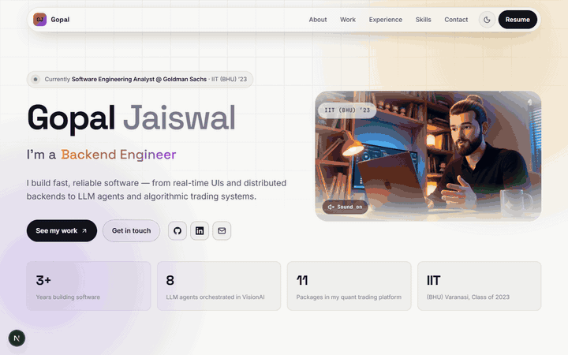

<!-- ===================== ANIMATED HEADER ===================== -->

 

 

<h2>Hey there! I'm Gopal 👋</h2>

 

  <b>🏦 Software Engineering Analyst @ Goldman Sachs</b> &nbsp;·&nbsp; <b>🎓 IIT (BHU) Varanasi '23</b>

  Building at the intersection of
  <b>Artificial Intelligence, Quantitative Research,
  and Software Engineering.</b>

 

  

---

<!-- ===================== ABOUT ME ===================== -->

## 👨‍💻 About Me

Software engineer working where **AI meets finance**. At **Goldman Sachs** I build agentic AI research tooling for Investment Banking and ML-driven analytics for Equity Derivatives. Before that I scaled assessment and semantic-search systems in ed-tech, and a multi-tenant EMR platform in health-tech.

- 🏦 **Software Engineering Analyst @ Goldman Sachs** — Banker Copilot (LangGraph · AWS Bedrock · pgvector) and options analytics in C++/Golang/Python.
- 🤖 Building **VisionAI**, a multi-agent AI workspace on LangGraph with RAG and multimodal LLMs.
- 📈 Building a **Quant Trading & Research Platform** — market-data pipelines, event-driven backtesting, walk-forward ML and pre-trade risk.
- ⚡ Scaled an assessment engine to **100K+ concurrent users** — latency **−40%**, throughput **+35%**.
- 🔍 Built semantic search over **2M+ documents** — duplicates down **95%**.
- 🎓 **B.Tech, IIT (BHU) Varanasi** — Class of 2023, CGPA **8.26**.

> Systems that stay correct under load — and ship.

---

<!-- ===================== EXPERIENCE ===================== -->

## 💼 Experience

<table>

<tr>
<td width="210" valign="top">
  <b>Goldman Sachs</b> 
  Software Engineering Analyst 
  <code>Jun 2025 — Present</code> 
  Bengaluru
</td>
<td valign="top">
  <b>Banker Copilot</b> — full-stack agentic AI platform for multi-agent financial research: secure semantic retrieval over PostgreSQL/pgvector, peer analysis and cited report generation, with asynchronous document ingestion on Celery + Redis.  
  <b>Equity Derivatives</b> — ML-driven options trading analytics: real-time market data over Kafka, volatility forecasting with XGBoost, Greeks-based risk and historical strategy simulation, shipped as containers on Docker + Kubernetes.  
  <code>Python</code> <code>TypeScript</code> <code>C++</code> <code>Golang</code> <code>FastAPI</code> <code>LangGraph</code> <code>AWS Bedrock</code> <code>pgvector</code> <code>Kafka</code> <code>Kubernetes</code>
</td>
</tr>

<tr>
<td width="210" valign="top">
  <b>Casahealth Tech</b> 
  Software Engineer II 
  <code>Feb 2025 — Jun 2025</code>
</td>
<td valign="top">
  <b>Healthcare Workflow Engine</b> — multi-tenant EMR platform automating appointment scheduling, clinical workflows and patient records through event-driven processing, configurable state transitions, idempotent execution, retries and audit logging.  
  <code>Java</code> <code>Spring Boot</code> <code>RabbitMQ</code> <code>Redis</code> <code>PostgreSQL</code> <code>Docker</code>
</td>
</tr>

<tr>
<td width="210" valign="top">
  <b>Edfora Infotech</b> 
  Software Engineer 
  <code>Jun 2023 — Feb 2025</code>
</td>
<td valign="top">
  <b>Assessment Engine</b> — online/offline platform for <b>100K+ concurrent users</b> and 80K+ exam responses; optimized scoring, rankings and leaderboards — <b>latency −40%</b>, <b>throughput +35%</b>.  
  <b>AI Knowledge Engine</b> — semantic question processing across <b>2M+ questions</b> with OCR/LaTeX extraction, NLP classification and vector similarity search — <b>duplicates −95%</b>.  
  <b>Personalized Learning Engine</b> — ML recommendations combining performance analytics and question metadata — <b>engagement +20%</b>.  
  <code>C++</code> <code>Rust</code> <code>Node.js</code> <code>FastAPI</code> <code>Kafka</code> <code>MongoDB</code> <code>FAISS / Pinecone</code> <code>XGBoost</code> <code>AWS SQS</code>
</td>
</tr>

</table>

---

<!-- ===================== FEATURED PROJECTS ===================== -->

## 🖥️ Portfolio

 

---

## 🚀 Featured Projects

<table>
<tr>

<td width="50%" valign="top">

<h3>🤖 VisionAI</h3>

A multi-agent AI workspace featuring intelligent request routing,
PDF RAG, web search, coding assistance, document generation,
image generation, and multimodal AI.

<b>Tech Stack</b>

  

<code>React</code>
<code>Vite</code>
<code>Redux Toolkit</code>
<code>Node.js</code>
<code>Express.js</code>
<code>LangChain</code>
<code>LangGraph</code>
<code>Qdrant</code>
<code>Gemini</code>
<code>Groq</code>
<code>OpenRouter</code>
<code>Tavily</code>
<code>Redis</code>
<code>MongoDB</code>
<code>Firebase</code>
<code>Docker</code>
<code>AWS ECS</code>

  

</td>

<td width="50%" valign="top">

<h3>📈 Quant Trading & Research Platform</h3>

An India-focused algorithmic trading platform integrating market-data
pipelines, event-driven backtesting, ML strategy research,
walk-forward validation, and pre-trade risk controls.

<b>Tech Stack</b>

  

<code>Python</code>
<code>Pandas</code>
<code>NumPy</code>
<code>PyArrow</code>
<code>DuckDB</code>
<code>Parquet</code>
<code>Pydantic</code>
<code>WebSockets</code>
<code>XGBoost</code>
<code>Optuna</code>
<code>Streamlit</code>

  

  

Private repository — happy to walk through the design.

</td>

</tr>

<tr>

<td width="50%" valign="top">

<h3>🎨 FigForge</h3>

A collaborative design canvas featuring live multiplayer cursors,
real-time chat, reactions, interactive drawing tools,
and shared design experiences.

<b>Tech Stack</b>

  

<code>Next.js</code>
<code>TypeScript</code>
<code>Liveblocks</code>
<code>Fabric.js</code>
<code>Tailwind CSS</code>
<code>shadcn/ui</code>

  

</td>

<td width="50%" valign="top">

<h3>☁️ NanoVercel</h3>

A Vercel-inspired deployment platform featuring containerized builds,
S3 artifact storage, reverse-proxy routing, and streamed build logs.

<b>Tech Stack</b>

  

<code>Node.js</code>
<code>Express.js</code>
<code>Next.js</code>
<code>Docker</code>
<code>AWS ECS</code>
<code>Amazon S3</code>
<code>Kafka</code>
<code>Socket.IO</code>

  

</td>

</tr>

<tr>

<td width="50%" valign="top">

<h3>🎤 AI HireBooster</h3>

A full-stack AI interview coach — upload a resume, get a role-specific technical or HR interview with voice answering, per-answer evaluation and a downloadable performance report.

<b>Tech Stack</b>

  

<code>React</code>
<code>Vite</code>
<code>Redux Toolkit</code>
<code>Node.js</code>
<code>Express.js</code>
<code>MongoDB</code>
<code>Firebase Auth</code>
<code>OpenRouter</code>
<code>Razorpay</code>

  

</td>

<td width="50%" valign="top">

<h3>🧩 PageChat</h3>

A Chrome extension and FastAPI backend that answers questions about the page you are on — retrieval over the page content, with a live web-search fallback when the answer is not there.

<b>Tech Stack</b>

  

<code>Python</code>
<code>FastAPI</code>
<code>Chrome Extension</code>
<code>RAG</code>
<code>LLMs</code>
<code>Render</code>

  

</td>

</tr>

<tr>

<td width="50%" valign="top">

<h3>🎬 MagicStream</h3>

A movie streaming platform with a React client and a Go/Gin API — catalog browsing, JWT refresh-token auth in HttpOnly cookies, and an LLM that classifies admin reviews into ranking categories.

<b>Tech Stack</b>

  

<code>Go</code>
<code>Gin</code>
<code>React</code>
<code>MongoDB</code>
<code>JWT</code>
<code>LangChainGo</code>
<code>OpenAI</code>

  

</td>

<td width="50%" valign="top">

<h3>🐦 Twitter Clone</h3>

Type-safe Twitter clone with Google OAuth, tweets with images, likes and follows — a GraphQL API on Node with Prisma and Postgres behind a Next.js client.

<b>Tech Stack</b>

  

<code>Next.js</code>
<code>GraphQL</code>
<code>Prisma</code>
<code>PostgreSQL</code>
<code>Redis</code>
<code>AWS S3</code>

  

</td>

</tr>

</table>

[Explore All My Repositories →](https://github.com/iitian-gopu?tab=repositories)

---

<!-- ===================== TECH STACK ===================== -->

## 🛠️ Tech Stack & Tools

### 💻 Programming Languages

`Python` · `Java` · `C++` · `Golang` · `Rust` · `JavaScript` · `TypeScript` · `SQL`

### 🎨 Frontend Engineering

`React` · `Next.js` · `Angular` · `Redux Toolkit` · `Tailwind CSS` · `Vite` · `React Query` · `Fabric.js` · `Liveblocks` · `shadcn/ui` · `Monaco Editor`

### ⚙️ Backend Engineering & APIs

`Node.js` · `Express.js` · `Spring Boot` · `FastAPI` · `Flask` · `GraphQL` · `REST APIs` · `WebSockets` · `Socket.IO` · `Microservices` · `Event-Driven Architecture` · `API Gateway` · `JWT`

### 🗄️ Databases, Search & Caching

`PostgreSQL` · `MongoDB` · `MySQL` · `Redis` · `Elasticsearch` · `OpenSearch` · `Qdrant` · `Pinecone` · `FAISS` · `pgvector` · `DuckDB` · `Parquet`

### 🤖 Generative AI & Agentic Systems

`LangChain` · `LangGraph` · `Agentic AI` · `Multi-Agent Systems` · `RAG` · `LLMs` · `Gemini` · `Groq` · `OpenRouter` · `Tavily` · `Qdrant` · `Vector Embeddings` · `Semantic Search` · `Prompt Engineering` · `Multimodal AI` · `LLM Tool Calling`

### 🧠 Machine Learning & Data Science

`Scikit-learn` · `XGBoost` · `PyTorch` · `Pandas` · `NumPy` · `Optuna` · `Feature Engineering` · `Model Evaluation` · `Time-Series Analysis` · `Statistical Modeling` · `Sentence Transformers`

### 📈 Quantitative Research & Trading

`Market-Data Pipelines` · `Equities` · `Futures` · `Options` · `OHLCV` · `Bid-Ask Data` · `Event-Driven Backtesting` · `Transaction Costs` · `Slippage Modeling` · `Walk-Forward Validation` · `ML Strategy Research` · `Risk Modeling` · `VaR` · `Position Limits` · `Kill Switch` · `Options Greeks` · `P&L Attribution`

### ☁️ Cloud, DevOps & Infrastructure

`AWS ECS` · `Amazon ECR` · `Amazon S3` · `CloudFront` · `AWS SQS` · `Docker` · `Kubernetes` · `Terraform` · `GitHub Actions` · `Jenkins` · `CI/CD` · `Linux` · `Git` · `Kafka` · `RabbitMQ`

### 🧩 Engineering Fundamentals

`Data Structures & Algorithms` · `Object-Oriented Programming` · `System Design` · `Low-Level Design` · `Distributed Systems` · `Multithreading` · `Concurrency` · `Database Design` · `REST API Design` · `Microservices` · `Scalability` · `Performance Optimization` · `Testing` · `Debugging`

---

<!-- ===================== GITHUB STATS ===================== -->

## 📊 GitHub Activity

 

 

---

<!-- ===================== ACHIEVEMENTS ===================== -->

## 🏆 Achievements

<table>
<tr>
<td width="50%" align="center">
  <h3>🥇 Global Rank 402</h3>
  <b>TCS CodeVita — Season 10</b> 
  among 100K+ participants worldwide
</td>
<td width="50%" align="center">
  <h3>🎯 Top 5%</h3>
  <b>Finalist — Jumpstart '22, Publicis Sapient</b> 
  of 29K+ participants
</td>
</tr>
</table>

---

<!-- ===================== CONNECT ===================== -->

## 📫 Let's Connect

  Interested in conversations about
  <b>AI engineering, quantitative research,
  backend systems, and open-source development.</b>

 

  

<h3>Build. Learn. Ship. Repeat.</h3>

